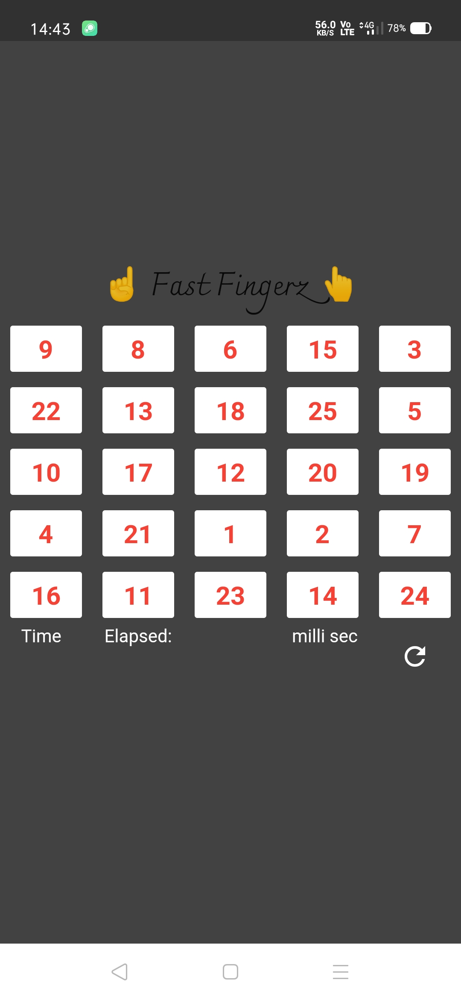
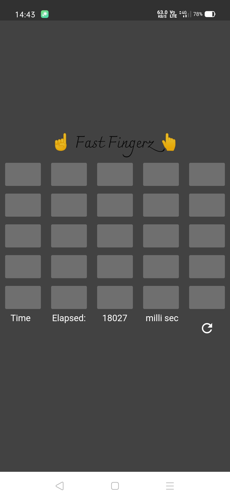

# fastfingerz
Android Game in its Initial Stage.

## What is game all about?
Player has to tap all numbers (arranged randomly) in Ascending Order and app will record the time you took to do it.
More time you take less speedy your brain is. 🤷‍
Get this app [here](release_APKs/)

## TODOs
 - [ ] Improve UI.
 - [ ] Use SnackBar to Display Score/ time taken by user.
 - [ ] Add Google Sign In
 - [ ] Connect to Firebase.
 - [ ] App Local Storage to store Score and retain Scores when player is Offline.
 - [ ] Create a Global LeaderBoard.
### Screenshots

|Initial Screeen|Game Over |
|:---:|:---:|
|||

----------------------------------------------------------------------

## Getting Started with Flutter

This project is a starting point for a Flutter application.

A few resources to get you started if this is your first Flutter project:

- [Lab: Write your first Flutter app](https://flutter.dev/docs/get-started/codelab)
- [Cookbook: Useful Flutter samples](https://flutter.dev/docs/cookbook)

For help getting started with Flutter, view our
[online documentation](https://flutter.dev/docs), which offers tutorials,
samples, guidance on mobile development, and a full API reference.
